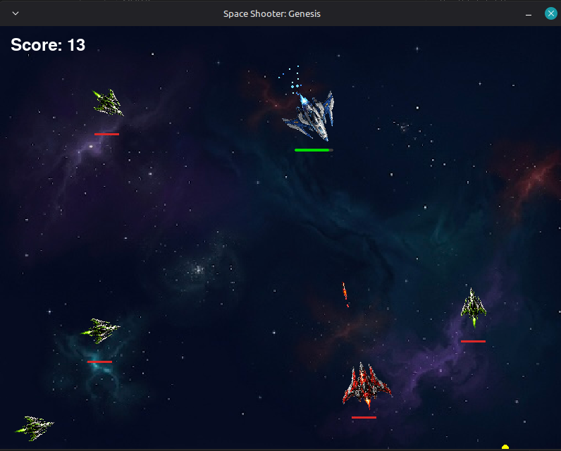

# 🚀 Space Shooter: Genesis

A fast-paced 2D space shooter built with **Python** and **Pygame**.

Destroy enemy ships, dodge incoming fire, and survive as long as possible while your score climbs!

---

## 🎮 Features

- 🚀 Mouse-aimed spaceship
- 🔫 Player and enemy shooting
- 👾 Three enemy types:
  - Scout
  - Fighter
  - Tank
- ❤️ Health bars
- 💥 Explosion particle effects
- 🔥 Engine flame effects
- 🎵 Sound effects and background music
- 🌌 Space background with custom sprites
- 🔄 Game Over and Replay screen

---

## 🕹 Controls

| Action | Control |
|--------|---------|
| Move | **W A S D** or **Arrow Keys** |
| Aim | **Mouse** |
| Shoot | **Left Mouse Button** |
| Replay | **Space** |
| Quit (Game Over screen) | **Esc** |

---

## 📦 Requirements

- Python 3.x
- Pygame

Install Pygame:

```bash
pip install pygame
```

---

## ▶️ Run the game

```bash
python main.py
```

---

## 📸 Screenshot



---

## 🛠 Built With

- Python
- Pygame

---

## 📌 Future Plans

- Main Menu upgrades
- Pause Menu
- Boss Battles
- More enemy types
- Power-ups
- Better visual effects
- Persistent high scores
- Executable releases for Windows

---

## 👨‍💻 Author

Created by **Icev099**

This is my first complete game made with Python and Pygame.
